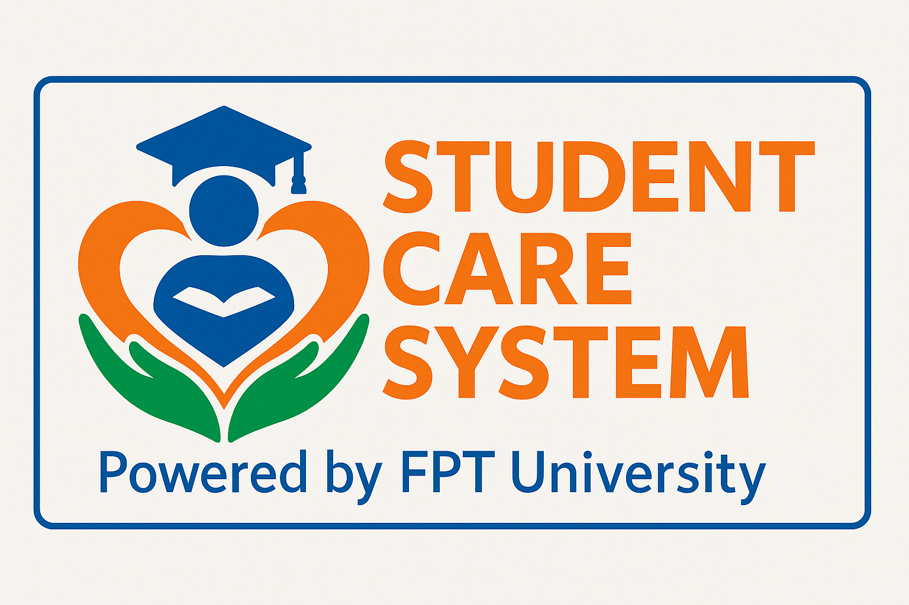
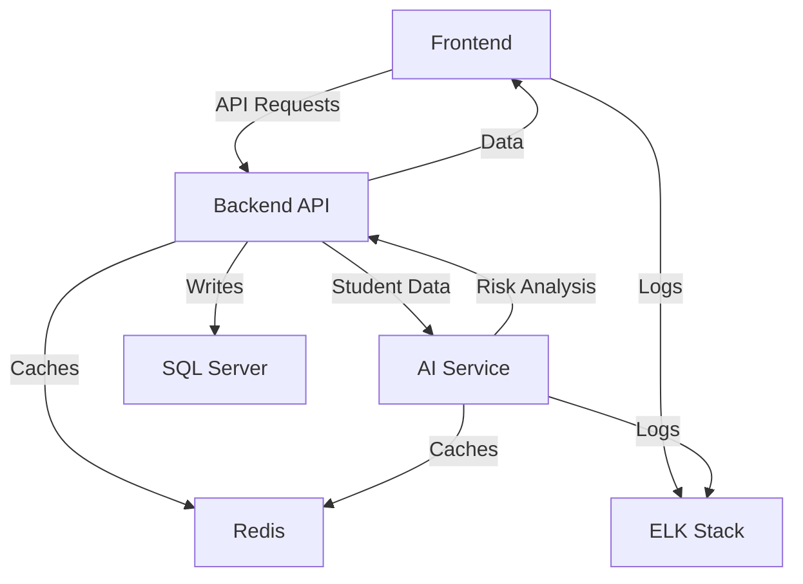

# Student Care System



[](https://dotnet.microsoft.com/)
[](https://reactjs.org/)
[](https://vike.dev/)
[](https://www.python.org/)
[](https://www.docker.com/)
[](https://www.elastic.co/)

## 📚 Overview

StudentCareSystem is an enterprise-grade platform for educational institutions to monitor and manage student welfare. It identifies students needing additional support based on attendance, academics, and behavioral data. The system features:
- Clean Architecture backend (.NET 9.0, DDD)
- SSR frontend (React 18, Vike, Zustand, TanStack Query, Ant Design)
- AI risk analysis (Python FastAPI)
- SQL Server, Redis, ELK Stack for data, caching, and monitoring
- Docker Compose deployment with .env configuration
- Comprehensive testing suite for all major modules

Developed as a capstone for FPT University, it streamlines care workflows, supports early intervention, and integrates analytics for actionable insights.

## 🏗️ System Architecture

StudentCareSystem follows a microservices architecture consisting of three primary components:

### 1. Backend (.NET 9.0)

The backend implements **Clean Architecture** with domain-driven design:

- **Domain Layer**: Core business entities and business rules
- **Application Layer**: Application-specific business rules and use cases
- **Infrastructure Layer**: Data persistence, external services integration
- **API Layer**: RESTful endpoints exposing system functionality

### 2. Frontend (React 18 with Vike SSR)

The frontend implements a **Component-Based Architecture**:

- **Presentation Layer**: UI components with Ant Design
- **State Management**: Zustand and TanStack Query
- **Service Layer**: API integration with Axios
- **Server Layer**: Express server with Vike for SSR
- **Security Layer**: Code obfuscation, CSP, encrypted storage

### 3. AI Service (Python FastAPI)

AI-powered service for:

- Student risk analysis and prediction
- Attendance pattern recognition
- Academic performance trend analysis
- Recommendation generation for intervention

### 4. Supporting Services

- **SQL Server**: Primary database
- **Redis**: Caching layer
- **Elasticsearch, Kibana, Filebeat**: Logging and monitoring

## 📊 Data Flow



## 🔑 Key Features

### Multi-Tenant System

- Support for multiple campuses within FPT University with data isolation
- Customizable workflows per department and campus
- Role-based access control with fine-grained permissions for different staff roles (advisors, officers, managers)

### Student Care Management

- Comprehensive student profiles
- Need assessment and care assignment
- Progress tracking against defined criteria
- Note-taking and documentation

### Attendance Monitoring

- Real-time attendance tracking
- Pattern recognition for concerning attendance
- Automated notifications for absence thresholds
- Visualization of attendance trends

### Academic Performance

- Integration with academic systems
- Performance tracking across semesters
- Early warning indicators for declining performance
- Intervention recommendations

### AI-Powered Risk Analysis

- Predictive analytics for student risk factors
- Multi-dimensional risk assessment
- Automated priority scoring
- Recommendation engine for interventions

### Communication

- Email notification system
- Communication templates
- Follow-up scheduling
- Communication logs

## 🚀 Getting Started

### Prerequisites

- Docker and Docker Compose
- Git

### Quick Start

1. Clone the repository:

   ```bash
   git clone https://github.com/SCS-Capstone-Spring-25/StudentCareSystem_Sp25.git
   cd StudentCareSystem_Sp25
   ```

2. Create a `.env` file in the root directory with the following variables:

   ```env

   # JWT Configuration
   JWT_SECRET=your_jwt_secret_key
   JWT_ISSUER=StudentCareSystem
   JWT_AUDIENCE=SCSUsers
   ACCESS_TOKEN_EXPIRATION=60
   REFRESH_TOKEN_EXPIRATION=1440

   # Redis Configuration
   REDIS_CONNECTION_STRING=redis:6379

   # Google OAuth
   GOOGLE_CLIENT_ID=your_google_client_id
   GOOGLE_CLIENT_SECRET=your_google_client_secret

   # AI Service
   AI_SERVICE_URL=http://ai-service:8000
   AI_API_KEY=your_ai_api_key

   # Frontend Configuration
   VITE_API_URL=http://aspnet-api:8080
   VITE_API_VERSION=v1
   PUBLIC_ENV__META__GOOGLE_CLIENT_KEY=your_google_client_key
   ```

3. Start the application:

   ```bash
   docker-compose up
   ```

4. Access the application:
   - Frontend: <http://localhost:3000>
   - Backend API: <http://localhost:8080/swagger>
   - AI Service: <http://localhost:8000/docs>
   - Kibana: <http://localhost:5601>

## 🧪 Development Environment

### Backend Development

```bash
cd Backend
dotnet restore
dotnet run --project StudentCareSystem.API
```

### Frontend Development

```bash
cd Frontend
npm install
npm run dev
```

### AI Service Development

```bash
cd ai-service
pip install -r requirements.txt
python -m app.main
```

## 🔧 Component Details

### Backend

- **.NET 9.0** with Clean Architecture
- **Entity Framework Core** for ORM
- **JWT Authentication** for secure access
- **Redis** for distributed caching
- **Serilog** for structured logging
- **Swagger/OpenAPI** for API documentation

### Frontend

- **React 18** with **Vike SSR** framework
- **Zustand** and **TanStack Query** for state management
- **Ant Design** with Pro Components for UI
- **Axios** with retry capabilities for API communication
- **Zod** for form validation
- **Recharts** for data visualization
- **JWT** with Google OAuth integration

### AI Service

- **FastAPI** for high-performance API
- **Scikit-learn/PyTorch** for machine learning models
- **Pandas** for data manipulation
- **Celery** for background tasks
- **Redis** for task queue

### Monitoring & Logging

- **Elasticsearch** for log storage and search
- **Kibana** for log visualization and analysis
- **Filebeat** for log collection and forwarding

## 📋 Testing

Each component includes its own testing suite:

- **Backend**: NUnit, Moq, FluentAssertions
- **Frontend**: Jest, React Testing Library
- **AI Service**: Pytest

## 🔐 Security Features

- **JWT-based authentication**
- **Role-based authorization**
- **HTTPS enforcement**
- **Input validation and sanitization**
- **Protection against common vulnerabilities**
- **Code obfuscation for frontend**
- **CSP implementation**
- **Encrypted storage**

## 📦 Deployment

### Production Deployment

The system can be deployed in several ways:

1. **Docker Compose** (included in repository)

   ```bash
   docker-compose -f docker-compose-server.yml up -d
   ```

2. **Kubernetes** (recommended for production)

   - Helm charts are available in the `.k8s` directory
   - Follow instructions in the Kubernetes deployment guide

3. **Manual Deployment**
   - Deploy each component separately
   - Configure networking between components
   - Set up monitoring and logging

## 📝 Contributing

1. Fork the repository
2. Create a feature branch: `git checkout -b feature/my-feature`
3. Commit your changes: `git commit -am 'Add new feature'`
4. Push to the branch: `git push origin feature/my-feature`
5. Submit a pull request

## 🧠 Architecture Decisions

- **Clean Architecture** for clear separation of concerns
- **Domain-Driven Design** for complex domain modeling
- **Server-Side Rendering** for performance and security
- **AI integration** for predictive analytics

## 📄 License

[Specify your license here]

## 👥 Team

- Bùi Tuấn Sơn - Backend Lead, DevOps Engineer
- Nguyễn Vinh Quang - Frontend Lead
- Bùi Việt Hồng - AI/ML Specialist
- Vương Công Minh - UX/UI Designer
- Phạm Thanh Tùng - Backend, Frontend

## 🙏 Acknowledgments

- Special thanks to FPT University for supporting this capstone project
- Faculty mentors and advisors from the FPT University academic staff
- Student care department for providing domain expertise and requirements
- Open source technologies that made this project possible
